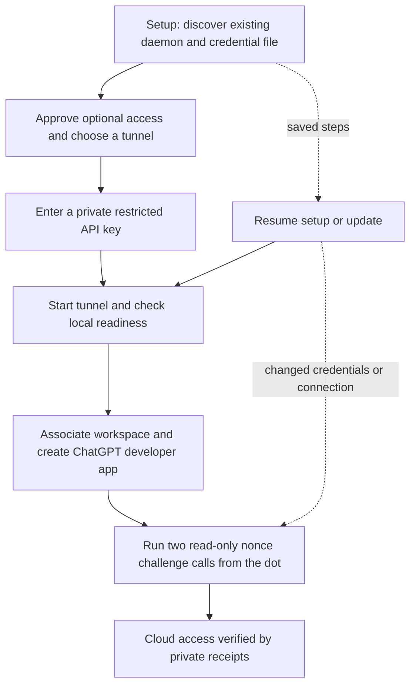

# Secure MCP Tunnel access from ChatGPT

An optional Secure MCP Tunnel connects a ChatGPT developer app to the same
Pseudolife daemon your local clients use. Guided setup saves private progress,
checks the existing MCP shim without starting a daemon, and keeps local client
and plugin registrations unchanged. Browser steps need your own account choices;
local readiness alone does not prove that your dot can access memory.



## Start or resume

Use an always-on host if you need access while a laptop sleeps. Both its daemon
and tunnel must remain running. Install Pseudolife normally, then run:

```sh
pseudolife-mcp tunnel setup
```

The installer can enter this same flow with `ops/install.sh --tunnel` or
`ops/install.ps1 -Tunnel`. Existing users can run the command directly. Setup
reuses saved choices and does not ask again for access consent or a saved key.
If discovery finds conflicting registrations or only a literal token, select the
connection explicitly using an existing owner-only token file:

```sh
pseudolife-mcp tunnel setup --daemon-url http://127.0.0.1:8765 --token-file <private-token-file> --accept-access
```

`--accept-access` records your consent to this access path. It does not create
accounts, API keys, workspace associations or apps. On a shell without a terminal,
pass it explicitly. A profile is named `dot` by default; `--profile <name>` keeps
separate connections. `--profile-dir <directory>` selects private profile storage.

## Complete the account steps

1. Open [Platform tunnel settings](https://platform.openai.com/settings/organization/tunnels).
   Check the selected organization, create or choose a tunnel, then copy its ID.
   Resume with `pseudolife-mcp tunnel setup --tunnel-id <tunnel_id>`; supply
   `--organization-id <organization_id>` when needed.
2. In that organization's [API key settings](https://platform.openai.com/settings/organization/api-keys),
   create a **Restricted** key with **Tunnels: Read + Use** for the running tunnel.
   Creating or editing a tunnel separately needs **Read + Manage**. Enter the
   runtime key privately with `pseudolife-mcp tunnel setup --read-key`, or use
   `--key-file <owner-only-file>`. Keep it out of chat, command arguments and
   environment variables. If its expiry is known, add
   `--key-expires-at 2026-12-01T00:00:00Z`; a date such as `2026-12-01` means
   midnight UTC. Timestamps need a timezone; otherwise status reports unknown
   when no expiry is supplied.
3. Start with `pseudolife-mcp tunnel start`, or use `tunnel run` in a foreground
   terminal. `tunnel setup --start` resumes setup and starts the managed process.
   Use `tunnel doctor` for local MCP and vendor checks.
4. In the intended ChatGPT workspace, open [developer apps](https://chatgpt.com/plugins),
   enable developer mode where available, create a developer app, choose
   **Connection: Tunnel**, and select this tunnel. Review the workspace
   association separately from the Platform organization and app creation.
   Availability and access follow those account/workspace settings.

`setup --open-browser tunnels`, `keys`, or `app` opens the selected step without
inventing an OAuth or device-code flow. Use the commands printed by setup to resume.
The local profile and key survive interrupted browser work.

## Prove access through the cloud

Run `pseudolife-mcp tunnel verify` after connecting the developer app, then paste
its exact prompt into your dot with that app enabled. It asks for `memory_search`
and `memory_agents(action="list")`, using a fresh nonce as the query and project
filter. Empty search results and zero matching peers are fine: these calls verify
the path without writing memory or changing the board. Optionally ask one cloud
child to repeat the prompt; no model API spending is launched by the CLI.

```sh
pseudolife-mcp tunnel status
pseudolife-mcp tunnel doctor --json
```

Only successful real responses to both challenge calls establish cloud verification.
The tunnel forwards the installed shim's MCP traffic and saves private receipts
containing tool names, success flags and timestamps, never memory or board contents.
Receipts match the actual ready launch, its saved profile, connection, key and
challenge. After changing a key, daemon, tunnel, organization or catalog, use
`tunnel setup --start` to start or refresh the managed tunnel before a new challenge.
An existing foreground run needs an explicit stop/start. Saved changes alone cannot
prove that the running tunnel adopted them. Vendor doctor checks and
`/readyz` remain separate local signals; they cannot establish cloud verification.

## Discovery, updates and renewal

The default catalog is the daemon's current discovery tier. Choose
`tunnel setup --catalog full` explicitly to keep full tool discovery available
after a daemon restart or tier expiry. This expands discovery for the reused
daemon principal, including its other sessions; it does not change authentication
permissions or create a dedicated principal. Each tools/list request rechecks full
discovery and restores it when needed, then reports an error if it cannot do so.

`pseudolife-mcp update` refreshes saved tunnel profiles alongside client updates;
`pseudolife-mcp tunnel update` updates only saved tunnels. Running managed tunnels
refresh their bridge and shim, even when the vendor version stays the same, and
must become locally ready before the update succeeds. A failed candidate attempts
to restore the previous immutable bridge/shim snapshot and readiness; a successful
rollback preserves availability but still reports a failed update needing attention.
Status shows this last refresh outcome separately from current runtime readiness.
Cloud proof binds to the active snapshot: a successful source refresh needs a new
challenge, while restoration of the same identity preserves existing proof files.

Older running records without a safe snapshot are refused unchanged; use an explicit
`tunnel stop` then `tunnel start` to adopt the managed refresh path. Rollback freezes
the bridge and stdio shim files plus their launcher, while shared helpers and
dependencies retain their installed versions. Changes to those shared components
can therefore require further repair or fresh cloud verification after rollback.
Idle profiles remain idle and no saved profile means no implicit new setup. The
supported upstream runtime stays checksum-pinned; updates do not choose upstream
latest or change profiles, keys, autostart consent or local client registrations.

Renew with `tunnel setup --read-key --key-expires-at <ISO-timestamp>`. A replacement
key is staged through local configuration checks before replacing the saved key;
a rejected candidate leaves the existing key and profile intact. These checks do
not prove cloud identity. Use `tunnel setup --start` to adopt the saved replacement
in a ready managed launch, then repeat `tunnel verify`. Failed refreshes restore
the previous launch; cloud proof is valid only when the saved selection agrees
with the actual restored configuration and credentials.
Correcting only the recorded expiry preserves cloud proof and does not require a
restart; the CLI still checks that expiry before starting a tunnel.

## Autostart and private storage

`tunnel service preview` shows the host service definition. Install it only after
reviewing it with `tunnel service install --accept-autostart`. Use
`tunnel service status`, `stop` or `remove` to manage the owned service;
`tunnel stop` stops an owned managed tunnel process.
Each install needs this explicit consent; saved consent does not authorize a new
installation. `--persistent` remains an equivalent compatibility option.

Windows and macOS services depend on the user's login session. A Linux user
service also normally depends on login; `--linger` explicitly opts into running
that user service while logged out. This may require host authorization. A root
Linux/LXC install instead needs the explicit `--system-service` choice on service
commands; it uses the existing root privilege and should be reviewed as such.
No root service or login policy is changed implicitly. An autostart service cannot keep
a sleeping or powered-off host available.

Windows stores the runtime key using user-scoped DPAPI plus owner-only ACLs;
POSIX stores it in an owner-only file, with disk encryption left to the host.
Private launch files exist only while the supervisor owns the process. The CLI
passes file references, never the API key in command arguments or the environment.
Do not copy private profile storage into a repository or share runtime logs.

The upstream [Secure MCP Tunnels runtime](https://developers.openai.com/api/docs/guides/secure-mcp-tunnels)
provides the account transport. Reusing it avoids a second custom tunnel protocol;
the small Pseudolife bridge adds resumable setup, discovery restoration and
payload-free verification while retaining the existing shim's authentication and
MCP behavior. It requires the upstream runtime and account features to remain
available, and browser account setup stays an explicit user step.
