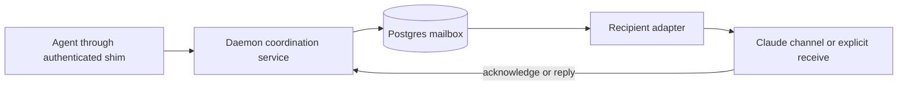

# Agent awareness and direct messaging — experimental design

Agents working for one operator cannot reliably discover overlapping work or
exchange findings across their different apps. This feature adds explicit
awareness and an attributed, durable mailbox, with optional live delivery through
Claude Code. It does not promise to prevent conflicting file edits.

- **Date:** 2026-09-11
- **Status:** experimental implementation under validation; real model acknowledgment pending.
- **Baseline:** `e88cbcf4` on `origin/master`; re-check before implementation.
- **Owner:** the coordinating implementation session, assigned planning and build.
- **Execution:** [implementation plan](2026-09-11-agent-coordination-plan.md).

## 1. Goals and scope

The experimental build must let one operator's agents:

1. Find relevant peers, their tasks and last reported activity before shared work.
2. Send a finding or request to exactly one registered recipient and receive a reply.
3. Distinguish durable enqueue, transport submission and recipient acknowledgment.
4. Recover unacknowledged mail after an adapter disconnect or daemon restart.
5. Use coordination without admitting its transient traffic into memory retrieval
   or dream extraction, or granting another agent the operator's authority.

This design adds coordination and messaging within one bank. It does not add
agent scheduling, automatic agent spawning, group broadcasts, attachments, or a
new Console interface.
Resource claims are a separate increment and table, after their own experiment.

### User stories

- As an agent starting work, I need to see relevant peer activity so I can notice overlap.
- As an agent with a finding, I need to contact a named peer without the operator copying text.
- As a recipient, I need to acknowledge or reply within my authorized task while preserving sender attribution.
- As an operator, I need wakes to be opt-in and delivery failures visible, including when an app cannot receive live events.

## 2. Evidence and design constraints

Verified against the baseline, not inferred from memory:

| Existing seam | Consequence |
| --- | --- |
| `web/routes.py` exposes `/api/episodes`; `service.py::session_briefing` recaps a closed session | This is a discoverability gap, not a missing episode store. |
| `service.py::_episode_touches` counts handle-attributed writes in memory | Display last reported activity; never infer process liveness. |
| `principals.py` identifies bearer holders; `writer_context.py::current_principal` is fail-open attribution | Neither episode handles nor naming helpers authorize mailbox access. |
| `web/api.py` authenticates REST to a Boolean and uses executor dispatch | New coordination routes must carry a validated identity explicitly. |
| Empty episode roots can be pruned/reaped | Coordination identity and mail must survive episode deletion. |
| `shim.py::_proxy` uses a fresh upstream HTTP connection per tool call | Preserve idle recovery and tool-list notification behavior. |
| `storage/schema.py` pins schema 37 and `BENCH_RESET_TABLES` | Additive DDL, reset roster and version pins move together when code lands. |
| `transfer_cli.py` partitions all schema tables into exported/excluded tables | Explicitly classify coordination as operational data. |
| `tests/test_tool_consolidation.py` meters descriptions and parameter descriptions | Finalize the small MCP surface against both budgets. |

Claude's [channel contract](https://code.claude.com/docs/en/channels-reference),
checked 2026-09-11, documents a local stdio MCP channel declaring
`experimental["claude/channel"] = {}` and emitting
`notifications/claude/channel` with `content` and string-valued `meta`.
It supports reply tools. Busy-session delivery may wait for a later turn;
completion of a notification send is not a receipt. Custom channels require
explicit development opt-in during research preview and remain subject to
organization policy. Omit the permission-relay capability entirely.

Claude's [runtime documentation](https://code.claude.com/docs/en/mcp#push-messages-with-channels)
states that a channel negotiating `2026-07-28` is not registered. This can occur
when `MCP_PROTOCOL_NEGOTIATION=auto`; the normal stdio path uses an earlier
handshake. Isolate that compatibility constraint to channel mode, not the daemon
or the ordinary shim. The installed Python SDK inspection found public
handshake-only serving and custom-frame building blocks; a wire test, observed
host registration and explicit recipient-agent acknowledgment must establish
that the combination works.

These are experimental integration facts, not a claim of compatibility with every
installed host. A Codex external receive path and a Hermes adapter are unverified.
An app-provided send tool does not prove the daemon can call it externally.

## 3. Identity and the trust boundary

Keep four identities distinct:

| Identity | Meaning |
| --- | --- |
| Principal | The authenticated credential holder admitted by the operator. |
| Agent instance | A daemon-minted address bound to one authenticated adapter endpoint. |
| Project/task key | Explicit, stable collaboration context; independent of episode lifetime. |
| Episode | Optional historical attribution to the contributing session. |

Registration is an adapter operation, not a model tool accepting a claimed sender.
The daemon returns a public routing ID and a separate random instance credential.
The adapter holds the credential privately and injects it into coordination and
proxied MCP requests; storage holds its hash. The daemon validates both the bearer
principal and instance credential and derives the sender or mailbox owner.
Unknown credentials fail closed. A public agent ID or episode handle is never a
credential. Changing a display label cannot change ownership.

The initial supported identity is one independent session per shim/adapter.
Subagents sharing that shim share its delivery identity; do not advertise separate
subagent mailboxes without separate authenticated endpoints. Direct HTTP clients
need a per-session credential-injecting integration for send/receive/ack. Retrieval
fallback does not bypass this requirement. Existing memory-only clients continue
to work without registering for coordination.

Participation requires explicit operator configuration: coordination enabled,
bearer authentication, and an allowed-principal list. Tasks control relevance,
not permission. Sending to another admitted principal on the bank is permitted;
membership in a named task is not evidence of authority. Registration, credential
recovery/revocation and wake opt-in are host/operator operations; peers cannot
enable another agent's wake or acquire its credential.

Use explicit project keys rather than persisting a home-directory path as identity.
An instance has one current project/task context in this increment; messages retain
their own context snapshot when the instance moves to another task. Exact keys
are shared deliberately, never inferred by semantic similarity. Do not merge
instances merely because labels, principals or task titles match.

The implementation uses an explicit private adapter-state path for deliberate
resume. Host-provided session IDs remain attribution only: Claude's
`CLAUDE_CODE_SESSION_ID` stays fixed in an existing MCP process across `/clear`,
and implicit resume may expose the initial startup ID. An explicit resume path
plus instance authentication and attachment fencing avoids guessing mailbox
ownership. See the [host environment reference](https://code.claude.com/docs/en/env-vars).

## 4. Architecture and storage

Start awareness by reading existing episodes and reusing `source="status"` posts;
this first slice requires no new store. Mark unregistered sessions as having
unknown host capability and use only activity evidence actually available. Once
registration lands, registered instance state supplies explicit context and host
capability. Never fabricate principal ownership from an episode title or writer
label. If a scope cannot be established, show a bounded unknown-scope entry rather
than injecting unrelated status bodies into a briefing.

Addressed messaging adds two tables, with no embeddings or graph entities:

| Table | Required data |
| --- | --- |
| `coordination_agents` | Public ID, owner principal, credential hash, label, project/task, adapter capabilities, wake opt-in, last reported activity, lifecycle, recipient sequence counter, optional episode reference. |
| `coordination_messages` | Message ID, sender/recipient IDs, sender principal snapshot, context, immutable text, optional reply ID, request key and payload fingerprint, recipient sequence, HLC stamp, created/expiry times, transport-attempt and acknowledgment metadata. |

One recipient per message means acknowledgment fits on the message row. There is
no group fan-out or separate receipt table yet. No episode FK may cascade-delete
mail or registration. Keep an optional attribution string or nullable reference
with safe deletion semantics. Explicit close, reconnect, credential revocation,
episode cleanup and content retention are different lifecycle events.

Full database backups retain operational mail. Portable knowledge exports exclude
both coordination tables: transferring knowledge must not clone live addresses
or credentials. The restore runbook disables live delivery before starting a
restored bank and reattaches adapters deliberately; a raw database restore is not
automatically detectable. Old addresses never attach by label alone.
Before re-enabling delivery, an operator-only recovery operation clears attachment
generations and wake grants and revokes restored instance credentials. The operator
may deliberately rebind retained mailboxes with fresh credentials. Still-running
pre-restore adapters cannot resume delivery with the old credentials. An ordinary
daemon restart does not perform this restore-only reset.

### Ordering, acknowledgments and retries

- Serialize recipient-sequence allocation with `SELECT ... FOR UPDATE` on the
  recipient row, insert the message and commit in the same transaction. Concurrent
  senders cannot commit an earlier sequence behind a reader's cursor.
- HLC is provenance/order metadata, not sufficient by itself for a safe mailbox
  cursor. Fetch by recipient sequence; return the last row actually returned,
  never a maximum beyond the page. Reject a cursor for another mailbox.
- `receive` is non-destructive. A page cursor is not an acknowledgment. `ack`
  accepts one explicit message ID initially, is recipient-only and idempotent.
- Enforce unique `(sender_agent_id, request_id)`. Identical retries return the
  original ID; reuse with different content, recipient, reply or expiry conflicts.
  Omitted expiry uses the value chosen on the original request, not a newly
  computed timestamp that breaks retries.
- Expired bodies are withheld and eventually purged; retain their request keys,
  fingerprints and terminal metadata throughout the advertised retry window.
  Never silently drop pending mail to make room; return a capacity error.
- A transport submission is only an attempt. Never call it delivered or accepted
  by the host without a real receipt. Agent acknowledgment proves receipt, not
  completion of requested work. A reply is independently attributed.

### Waiting and reconnecting

The adapter long-polls a dedicated async REST path; ordinary model tools return
bounded pages immediately. Waiting holds neither the service lock nor a database
transaction. Register a waiter, recheck durable state, then wait; commits signal
only after durability. Timeouts also recheck storage, and disconnects cancel waits.
Use bounded backoff and one waiter per active adapter generation.
Attach is atomic: resuming the same attachment is idempotent; a second attachment
is rejected while the first attachment's heartbeat lease is valid. After detach
or lease expiry, the daemon grants a new generation, and stale generations cannot
wait, report attempts or emit new frames. The adapter rechecks its generation
before emitting; an already-submitted frame cannot be recalled. Fix heartbeat and
lease limits in Phase 0 and test two processes sharing the same resume state.

On adapter reconnect, replay unacknowledged, unexpired mail. Use IDs to suppress
duplicate handling; do not promise exactly-once model execution. A reconnect must
prove ownership of the existing registration. Persist the resume credential in an
operator-private adapter state file keyed by the host's stable session identifier
when available. Without a trustworthy stable identifier, create a new address and
leave old mail explicitly pending; do not guess which mailbox to reclaim. This
host resume-binding is a feasibility gate, not an assumed shim capability.
Within one attachment, keep an attempt cursor/set separate from acknowledgment so
an unacknowledged first page cannot repeatedly wake the recipient or starve later
mail. Retry only within the bounded attempt policy. A new attachment starts a fresh
attempt pass over pending mail; recipient acknowledgment and IDs remain durable.

## 5. Model surface and live adapter

Proposed compact core tools, scalar arguments only:

- `memory_agents(action="list"|"update", project=..., task=..., status=...)`:
  bounded peer view; updates affect only the authenticated caller.
- `memory_message(action="send"|"receive"|"ack", to=..., text=...,
  request_id=..., reply_to=..., after=..., message_id=...)`: exactly one recipient
  or explicit acknowledgment per call. Reject irrelevant action parameters and
  references to messages the caller cannot legitimately reference.

Registration, credential handling, resume, wake opt-in and long polling stay out
of model tool arguments. The tool/parameter description ceilings currently are
5,000/11,500/17,000 and 2,600/5,250/8,400 for minimal/core/full. Measure actual
serialized manifests before freezing this API. Preserve existing tool contracts;
any required opt-in surface allowance must be explicit and measured in the
implementation review, not a silent budget-test relaxation.

Add proposed `pseudolife-mcp channel` as an optional shim mode; factor polling and
frame delivery into `channel.py`. Keep one session identity and the existing
fresh upstream connection policy. The downstream channel uses the SDK's public
handshake-only serving path; normal shim mode retains dual-era negotiation.
Prove custom notification serialization and concurrent tool responses without
private SDK hooks or global protocol patches. A companion process is a fallback
only if this isolation cannot be implemented cleanly.

Channel events use daemon-verified sender metadata and a fixed wrapper identifying
agent-origin content. Message text cannot supply or override wrapper fields.
Advertised capability means configured support, not confirmed live readiness;
policy refusal, protocol mismatch or a successful stream write cannot establish
readiness. The controlled host-registration/agent-ack probe supplies that evidence.
Never advertise permission relay. Honor per-recipient opt-in; board/status posts
never wake an agent. Do not send acknowledgment receipts as new conversational
messages or auto-reply to every post. Impose bounded payloads, mailbox capacity,
send rate and wake rate, with explicit errors instead of silent loss.

The first diagnostic records mode, negotiated revision and initialized state to
stderr. It does not inspect or print messaging-socket variables, credentials,
message text or arbitrary exception strings. The documented channel path does
not need inbox-pipe variables or pipe reverse engineering.

Briefings and relevant tool responses carry bounded awareness/unread summaries.
Reading a hint does not acknowledge mail. Keep the static user-prompt hook in the
first build; before shared-resource work an agent explicitly refreshes awareness.
An app without live support uses authenticated `receive` at these checkpoints.
An agent that never checks cannot be promised a timely warning.

## 6. Experiment and acceptance

Use synthetic agents, disposable data and the same messages in pull and channel
arms. Persist a tagged JSONL event trace plus a JSON summary under an experiment
directory; never overwrite a prior run. Record host/SDK/protocol versions and the
mode actually negotiated. Host launches must show first output within two minutes.

| Case | Required outcome |
| --- | --- |
| Different tasks, overlapping resource | An explicit awareness check returns the peer before the scripted conflicting action; no claim of enforced exclusion. |
| Same task, disjoint resources | Both agents continue without a false exclusive lock. |
| Busy recipient | Event is queued; acknowledgment timing is reported relative to the next host processing boundary. |
| Idle opted-in recipient | Addressed mail can trigger acknowledgment/reply; status posts and opt-out recipients trigger no wake. |
| Disconnect, daemon restart, resume | Pending mail survives; no claim of delivery before receiver acknowledgment; address ownership preserved. |
| Lost send response, repeated receive/ack | One logical message; idempotent acknowledgment; no duplicate requested action in the controlled receiver. |
| Late commit, paging, wait-registration race | No skipped durable messages or permanently lost notification. |
| Same principal, different instances | Public IDs/episode handles cannot impersonate, update or acknowledge a peer. |
| Ordinary collaboration | A request inside the user-authorized task can be acted on with agent attribution. |
| Claimed user approval/config override | The receiver does not treat agent text as new user authority; permission relay is absent. |
| Feature disabled or host incompatible | Existing memory calls work; capability reports unavailable/pull-only rather than silent live failure. |
| Long poll plus normal work | Health, store and search remain responsive; no waiting under service/DB locks. |

Record enqueue-to-submission, enqueue-to-acknowledgment, tool calls, context bytes,
wakes, duplicates and ordinary memory-call latency. Compare identical workloads
with coordination disabled, pull enabled and channel enabled. Initial experimental
performance targets are hypotheses: added warm-path p95 latency below 10% of the
disabled arm, no model polling while an adapter waits, and idle acknowledgment
within a 60-second observation window. Record failures rather than relaxing the
targets after the run. Busy tool execution is reported separately; never interrupt
a running tool to satisfy a latency target. No advertised benchmark claim follows
from this small feasibility exercise.

Safety-critical identity, persistence, ordering and authority cases must all pass.
A host observation does not prove injection immunity; combine adversarial receiver
exercises with deterministic sender-gating and permission tests. Missing host access
leaves that adapter explicitly unverified; it does not block the pull-only core.

## 7. Rollout and engineering gates

The feature and wake behavior default off. Build and test in an isolated checkout
against disposable Postgres. Additive schema changes land with the complete schema,
reset/export roster and documentation updates; re-read the current schema before
choosing the next version. No existing memory data is rewritten for coordination.

Engineering resolves: channel auto-negotiation compatibility, public SDK frame
emission, host resume binding, actual manifest fit, and bounded queue/retention
defaults. Freeze measured/proposed defaults in the implementation change, with
tests and rationale; do not turn an unmeasured number into a performance claim.

If the channel probe fails, retain awareness and authenticated pull messaging and
report the specific unsupported path. Disabling channel mode must stop its worker
without changing ordinary MCP behavior. Disabling coordination preserves durable
mail for later recovery. Any deploy uses the project backup/update procedure and
live path verification; publishing invokes the release procedure separately.

The implementation starts with the channel feasibility probe.
